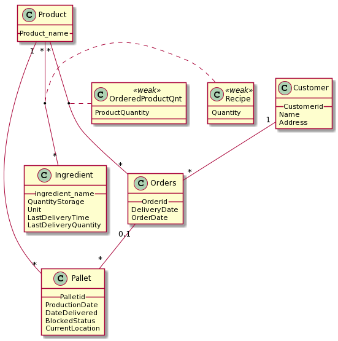

# EDAF75, project report

This is the report for

| First name | Last name  | stil_id |
| ------------- |:-------------:| -----:|
| Mats | Hallström  | psy14mha |
| Diederik | Harmsen  | ine15dha |

We solved this project on our own, except for:

 + The Peer-review meeting

 <!-- + ... describe any other help you've gotten ... -->


## ER-design

<!-- The model is in the file [`er-model.png`](er-model.png): -->


<center>
    
</center>

<!-- (The image above describes the model from lecture 4, you
must replace the file '`er-model.png`' with an image of your
own ER-model). -->


## Relations

<!-- The ER-model above gives the following relations (neither
[Markdown](https://docs.gitlab.com/ee/user/markdown.html)
nor [HTML5](https://en.wikipedia.org/wiki/HTML5) handles
underlining withtout resorting to
[CSS](https://en.wikipedia.org/wiki/Cascading_Style_Sheets),
so we use bold face for primary keys, italicized face for
foreign keys, and bold italicized face for attributes which
are both primary keys and foreign keys): -->

Bold face is used for primary keys, italicized face for
foreign keys, and bold italicized face for attributes which
are both primary keys and foreign keys


+ Ingredient(**Ingredient_name**, QuantityStorage, LastDeliveryTime, LastDeliveryQuantity, Unit)

+ Recipe(***Product_name***, *Ingredient_name*, Quantity)
+ Product(**Product_name**)
+ OrderedProductQnt(***Product_name***, ***Orderid***, ProductQuantity)
+ Order(**Orderid**, *Customerid*, OrderDate, DeliveryDate)
+ Customer(**Customerid**, Name, Address)
+ Pallet(**Palletid**, *Product_Name*, *Orderid*, ProductionDate, DateDelivered, BlockedStatus, CurrentLocation)


<!-- (this should be replaced with your own relations, of course,
but use the same way of marking primary keys and foreign
keys). -->


## Scripts to set up database

The scripts used to set up and populate the database are in:

 + [`create-schema.sql`](create-schema.sql) (defines the tables), and
 + [`initial-data.sql`](initial-data.sql) (inserts data).

So, to create and initialize the database, we run:

```shell
sqlite3 krusty-db.sqlite < create-schema.sql
sqlite3 krusty-db.sqlite < initial-data.sql
```

(or whatever you call your database file).

## How to compile and run the program

This section should give a few simple commands to type to
compile and run the program from the command line, such as:

```shell
./gradlew run
```

or

```shell
javac -d bin/ -cp src src/krusty/Main.java
java -cp bin:sqlite-jdbc.jar krusty.Main
```

or, if you put your commands into a `Makefile`:

```shell
make compile
make run
```
